<div align="center">


# SkillGame

**A modern recreation of the 1955 [Bally Skill-Roll](https://www.ipdb.org/machine.cgi?id=4331) coin-roll arcade game** — real coin, real hardware, modern brains.

`ALL HUFF · NO BULL` — WezeBull Games


</div>

---

The player rolls a physical coin up the playfield. It rides the rails, skims the scoring holes, and drops into one to score. Climb the levels without losing the coin to a **gobble hole** — or **tilting** — and you win. A mini-PC runs the whole machine over four FT232H boards and shows the backglass, diagnostics and operator console on a touch monitor.

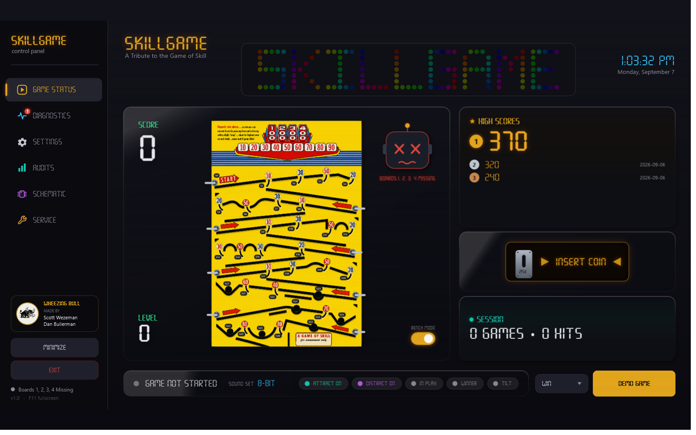

## Contents

- [How it plays](#how-it-plays) · [Features](#features) · [Screens](#screens) · [Hardware](#hardware) · [Build the board](#build-the-board) · [Build &amp; run the app](#build--run-the-app) · [Layout](#layout)

## How it plays

1. **Insert a coin** — a real coin drops through the mech and arms a shot.
2. **Roll it up the playfield.** The coin rides *on top* of the rails and skims across the scoring holes.
3. **Drop it in a hole to score** — `10`–`90`, then the big `100 / 200 / 300 / 400` reels.
4. **Beware the gobble holes.** As you climb into the danger levels the machine flashes its lights and plays a **distract** effect *before* your shot — a real Skill-Roll trick to make you flinch. A miss ends the game.
5. **Land the Winner hole to win.** Tilt the machine too hard and it's game over.

## Features

- 🎯 **Game Status backglass** — live score, level, lamps and the coin animation, driven by the real switch reads.
- 🔧 **Diagnostics** — a live switch map and lamp map, a one-touch **Self-Test** that lights every lamp / pulses the coils / sweeps the LED strip, per-lamp **Identify** blink, and **stuck-switch** detection that turns a tile solid red.
- 📊 **Audits** — plays, wins, hits, high scores and time played, watched over by the auditor gremlin. Demo/attract games are excluded, so the numbers only count real play.
- 🛠️ **Service** — a single-screen operator console for volume, quiet hours, tilt sensitivity and the rest.
- 🗺️ **Interactive schematic page** — a clickable system diagram with crossing-free animated wiring, plus one-tap access to the BOM, fuses, system hookup, full schematic, FT232H pinout and a 3D board viewer.
- 👻 **Attract / demo mode** — with no boards attached the app plays itself, so you can see the whole thing run on a laptop.
- ✅ **52 unit tests** over the game core — scoring, levels, tilt, coin gate, stuck detection and the switch router.

## Screens

| | |
|---|---|
| **Schematic** — interactive, clickable system diagram | **Diagnostics** — live switch + lamp maps, self-test |
| 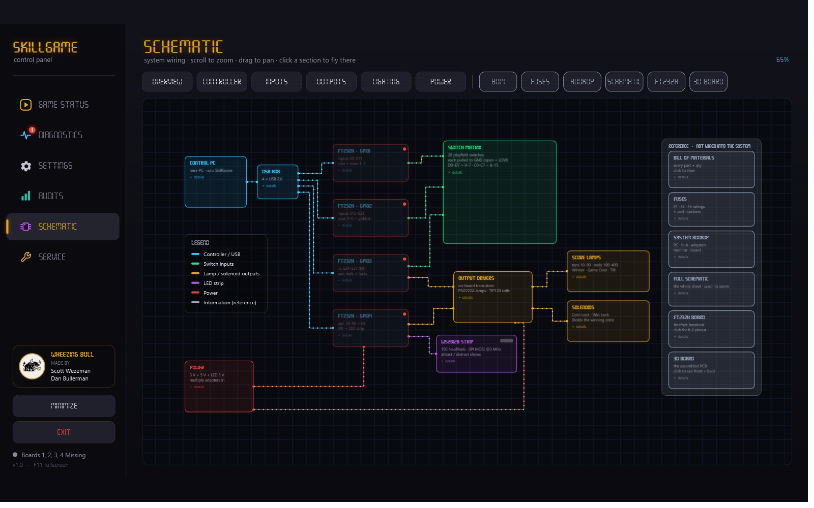 | 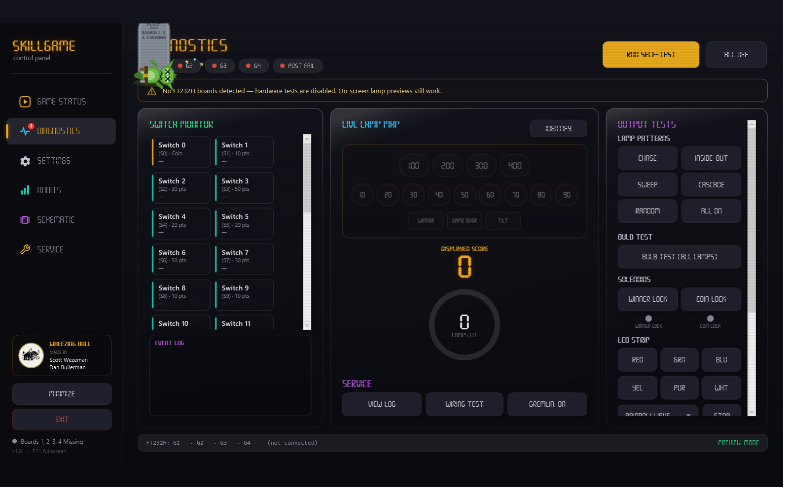 |
| **Audits** — plays, wins, hits, high scores (the gremlin) | **Service** — one-page operator console |
| 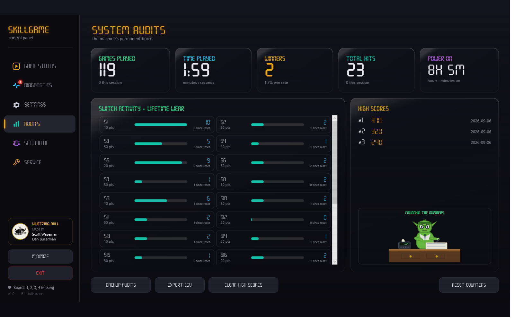 | 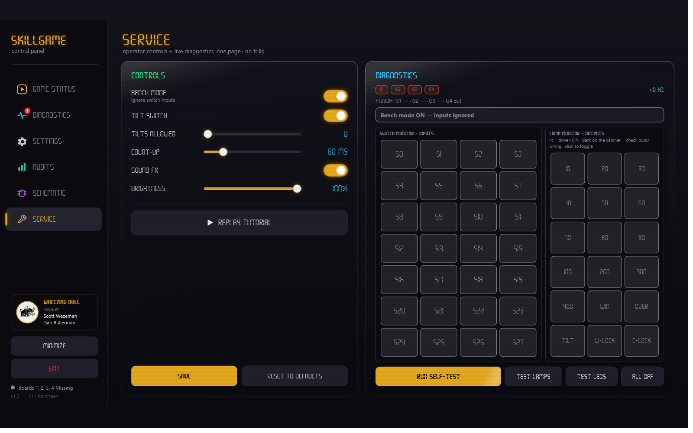 |

## Hardware

The control board is a custom KiCad 9 design driven by **four Adafruit FT232H** breakouts over USB (MPSSE mode). Everything the software touches maps 1:1 to a real pin.

| Section | What it does |
|---|---|
| **Inputs** | 28 switches on GPIO1–3 (S23 = 7 parallel gobble holes). Commons run on 3.3 V — the FT232H inputs are **not** 5 V-tolerant. |
| **Score lamps** | 16 lamps via PN2222A drivers → 16 off-board **#555 wedge LED bulbs**. |
| **Solenoids** | Coin-Lock + Winner-Lock, via TIP120 Darlingtons with 1N4004 flyback, fused (F1/F2 T2A). |
| **LED strip** | 150-pixel WS2812b on GPIO4's SPI line, on its own 5 V feed. |
| **Power** | 3.3 V → J1 (switch commons), 5 V → J3 / LED± (lamps, strip, coils), guarded by inline F3 (T3.5A). |

**The lamps are LEDs, wired honestly.** Each score lamp is a non-polar #555 wedge LED bulb in a twist-lock socket. Because the bulb is pre-resistored, the board's lamp positions (R30–R62) are **0 Ω links** — and a 6.3 V bulb on the 5 V rail runs safely under-driven. The **100 / 200 / 300 / 400** holes each drive **two** bulbs in parallel for double brightness.

| Score-lamp bulbs (schematic) | Board (3D) | System hookup |
|---|---|---|
| 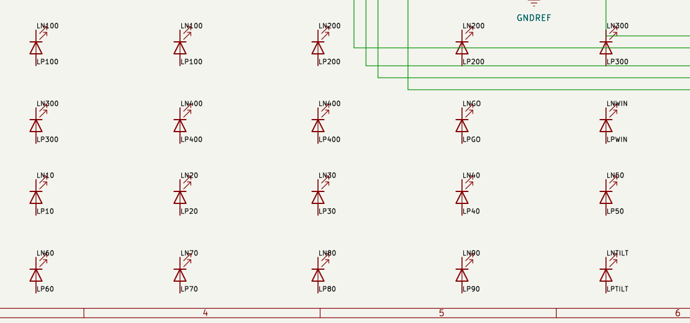 | 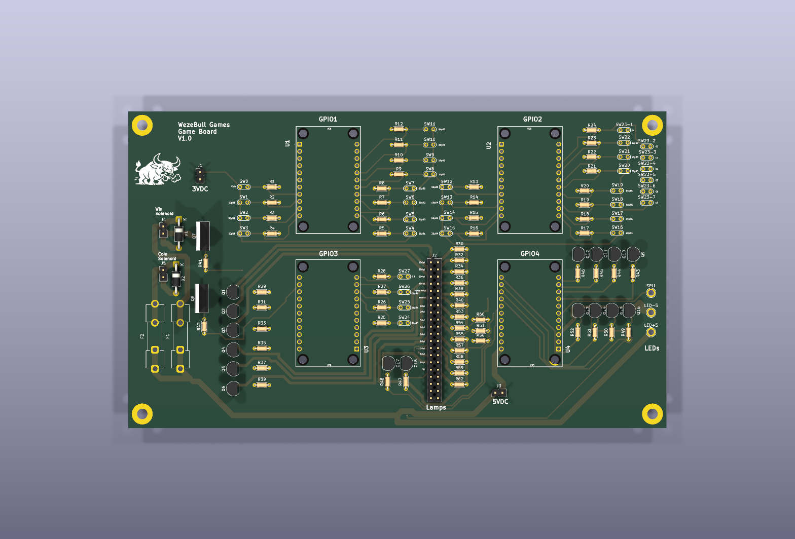 | 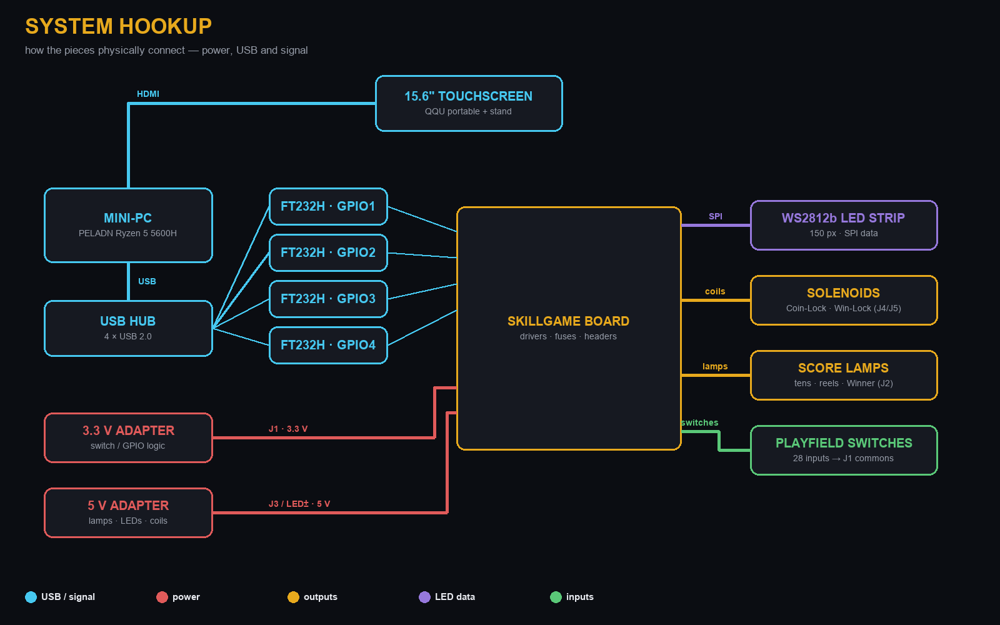 |

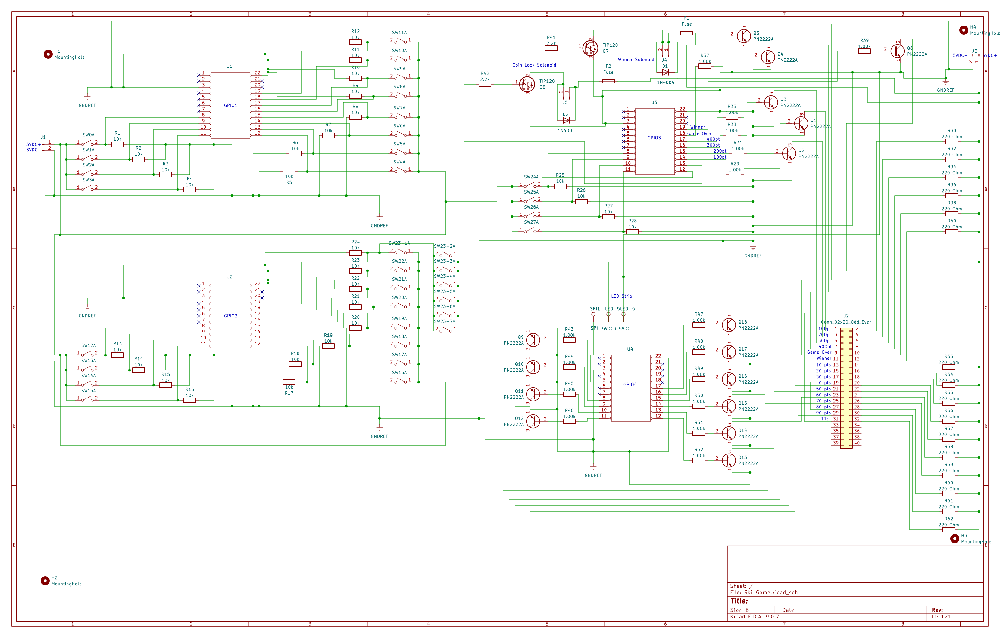

## Build the board

Everything you need to source and assemble it is in [`docs/`](docs/):

- 📋 **[Sourced BOM (xlsx)](docs/SkillGame%20BOM%20(sourced).xlsx)** — every part with vendor links + prices (mini-PC, monitor and power included).
- 📖 **[Assembly guide (PDF)](docs/SkillGame%20Assembly%20Guide.pdf)** — an IKEA-style, step-by-step build, parts list on page one.

The KiCad 9 project (schematic + PCB) lives in [`hardware/`](hardware/) — ERC clean and DRC clean.

## Wiring

Two harnesses join the off-board lamps and switches to the control board — the guide draws each one flat (every solder point), in 3D, and **in place on the real game**, so you can see exactly how the wires snake to each lamp socket and switch. Switch positions are traced from the actual Skill-Roll playfield.

| Switches on the playfield | Lamps on the backglass |
|---|---|
| 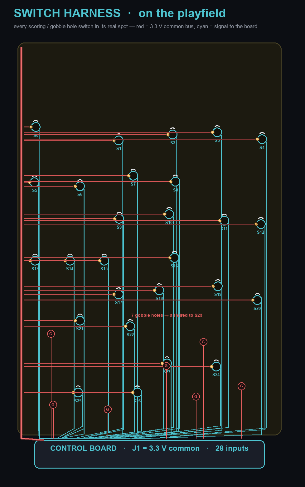 | 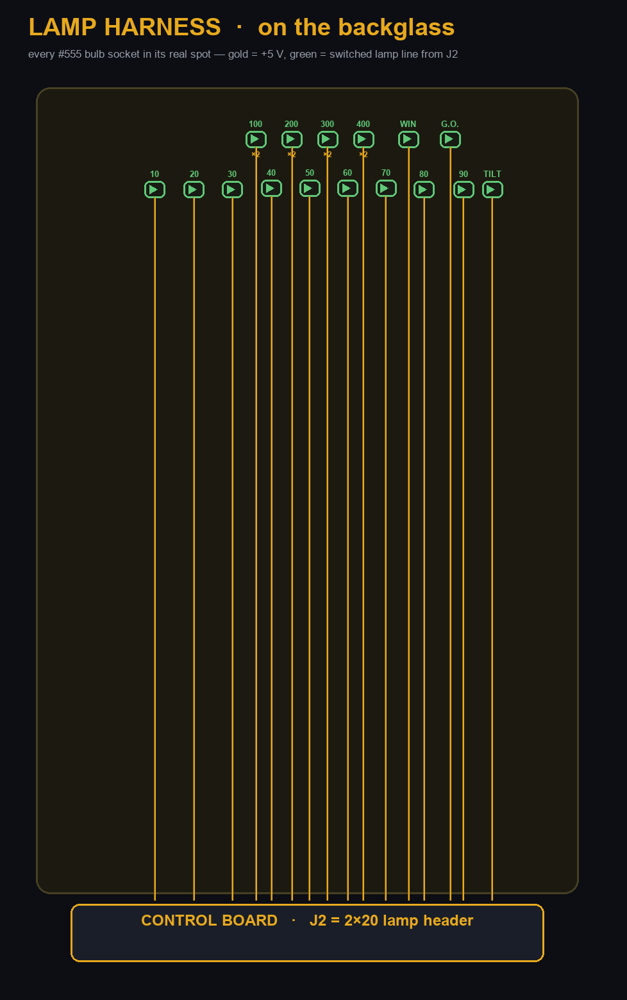 |

> **Switches:** the original Bally rollover-wire leaf switch is discontinued — a mini snap-action microswitch with a hinge lever (pokes up through the playfield slot, tripped by the coin) is the cheap, in-stock replacement. See the BOM for the pinball-authentic alternative.

## Build &amp; run the app

```bash
cd SkillGameWpf
dotnet build -c Debug -p:Platform=x64
```

```bash
cd "SkillGame Source/SkillGame.Tests"
dotnet test
```

The app targets `net8.0-windows` (WPF, x64). With no FT232H boards attached it runs in demo/preview mode, so you can try it on any Windows machine.

## Layout

| Folder | What it is |
|--------|-----------|
| `SkillGameWpf/` | The WPF (.NET 8) front-end / operator console — Game Status, Diagnostics, Settings, Audits, Schematic, Service. |
| `SkillGame Source/SkillGame/` | The UI-agnostic game core (engine, switch map, audits, hardware coordinator). The WPF app links these files directly. |
| `SkillGame Source/SkillGame.Tests/` | xUnit tests for the core. |
| `hardware/` | The KiCad 9 schematic + PCB for the WezeBull Games control board. |
| `docs/` | Sourced BOM, IKEA-style assembly guide, and the schematic-page images. |

## Credits

Scott Wezeman &amp; Dan Bullerman — **WezeBull Games**. *All huff, no bull.*
</content>
